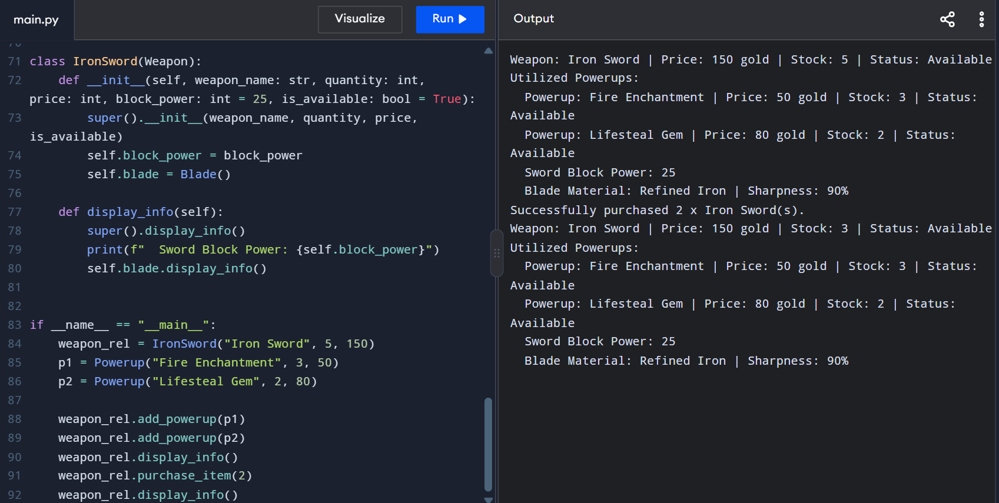

# Advanced Class Relationships

## Previous Activities
[classAttrib](q1/classAttributesMethods.md)
[classRel](q1/classRelationships.md)

## Existing System Description:
## Inheritance Relationship
Parent: Weapon
Child: Iron sword
Explanation: The parent class 'Weapon' is general class where a more speific class 'Iron sword' belongs to.

## Inheritance UML

## Composition/Aggregation
Relationship:
Explanation:
## Advanced UML Diagram

## Python Implementation
[Source Code](advancedRelationships.py)
## Test Run

## Object Diagram

## Reflection
Answers:
